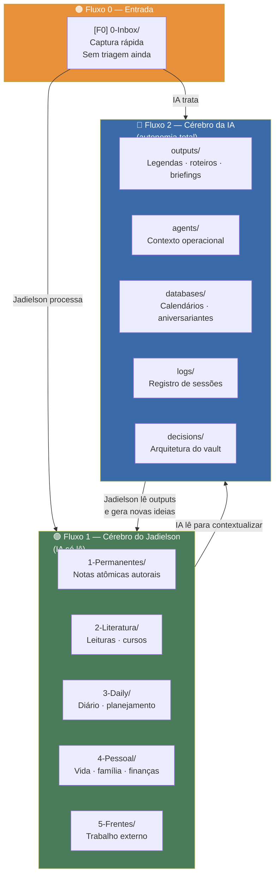
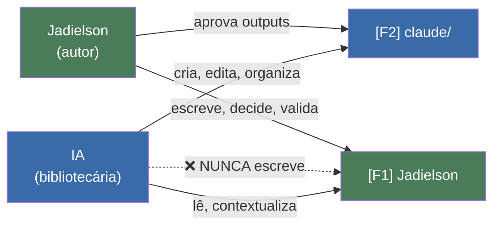

← [[Hub]]

# Os 3 Fluxos do Meu Vault

```mermaid
flowchart TB
    subgraph F0["🟠 Fluxo 0 — Entrada"]
        INBOX["[F0] 0-Inbox/\nCaptura rápida\nSem triagem ainda"]
    end

    subgraph F1["🟢 Fluxo 1 — Cérebro do Jadielson\n(IA só lê)"]
        PERM["1-Permanentes/\nNotas atômicas autorais"]
        LIT["2-Literatura/\nLeituras · cursos"]
        DAILY["3-Daily/\nDiário · planejamento"]
        PESS["4-Pessoal/\nVida · família · finanças"]
        FRENT["5-Frentes/\nTrabalho externo"]
    end

    subgraph F2["🔵 Fluxo 2 — Cérebro da IA\n(autonomia total)"]
        OUTPUTS["outputs/\nLegendas · roteiros · briefings"]
        AGENTS["agents/\nContexto operacional"]
        DB["databases/\nCalendários · aniversariantes"]
        LOGS["logs/\nRegistro de sessões"]
        DEC["decisions/\nArquitetura do vault"]
    end

    INBOX -->|"Jadielson processa"| F1
    INBOX -->|"IA trata"| F2

    F1 -->|"IA lê para contextualizar"| F2
    F2 -->|"Jadielson lê outputs\ne gera novas ideias"| F1

    style F0 fill:#e8913a,color:#fff
    style F1 fill:#4a7c59,color:#fff
    style F2 fill:#3a6ba8,color:#fff
```

---

## A Regra de Ouro

```mermaid
graph LR
    IA["IA\n(bibliotecária)"] -->|"cria, edita, organiza"| F2["[F2] claude/"]
    IA -->|"lê, contextualiza"| F1["[F1] Jadielson"]
    IA -.->|"❌ NUNCA escreve"| F1

    JAD["Jadielson\n(autor)"] -->|"escreve, decide, valida"| F1
    JAD -->|"aprova outputs"| F2

    style IA fill:#3a6ba8,color:#fff
    style JAD fill:#4a7c59,color:#fff
    style F2 fill:#3a6ba8,color:#fff
    style F1 fill:#4a7c59,color:#fff
```

> **Princípio:** O vault cresce pelo Jadielson, não pela IA. A IA amplifica, nunca substitui.
