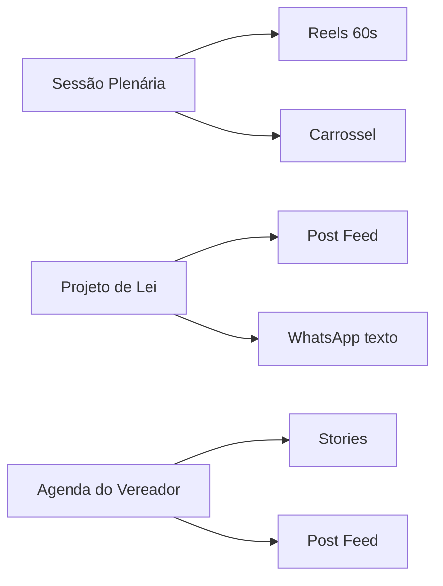

← [[Hub]]

# Fluxo Editorial — Câmara Municipal

```mermaid
flowchart LR
    PAUTA[📋 Pauta\nDefinição do tema\nou sessão] --> ROTEIRO[✍️ Roteiro\nEscrever texto\ne abordagem]
    ROTEIRO --> CAPTACAO[🎥 Captação\nGravação /\nFotografia]
    CAPTACAO --> EDICAO[✂️ Edição\nCorte, trilha\ne legenda]
    EDICAO --> REVISAO[👁️ Revisão\nJadielson ou\nvereador aprova]
    REVISAO -->|Ajustar| EDICAO
    REVISAO -->|Aprovado| PUBLICACAO[📲 Publicação\nInstagram ·\nWhatsApp]
    PUBLICACAO --> ARQUIVO[🗂️ Arquivo\nNota salva\ncomo publicado]

    style PAUTA fill:#e8c000,color:#000
    style ROTEIRO fill:#e8c000,color:#000
    style CAPTACAO fill:#e8c000,color:#000
    style EDICAO fill:#e8c000,color:#000
    style REVISAO fill:#e8c000,color:#000
    style PUBLICACAO fill:#4caf50,color:#fff
    style ARQUIVO fill:#888,color:#fff
```

## Formatos por Tipo de Conteúdo

```mermaid
graph LR
    SESSAO[Sessão Plenária] --> REELS[Reels 60s]
    SESSAO --> CARROSSEL[Carrossel]
    PROJETO[Projeto de Lei] --> POST[Post Feed]
    PROJETO --> WHATS[WhatsApp texto]
    AGENDA[Agenda do Vereador] --> STORIES[Stories]
    AGENDA --> FEED[Post Feed]
```
