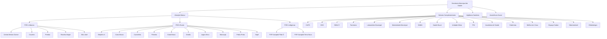

← [[Hub]]

# Organograma — Saúde São Sebastião

```mermaid
graph TD
    SMS[Secretaria Municipal de Saúde]

    SMS --> AB[Atenção Básica]
    SMS --> SETORES[Setores Complementares]
    SMS --> VIGILANCIA[Vigilância Sanitária]
    SMS --> SOCIAL[Assistência Social]

    AB --> URBANA[PSFs Urbanos]
    AB --> RURAL[PSFs Rurais]
    AB --> INDIGENA[PSFs Indígenas]

    URBANA --> U1[Centro Mestra Clarice]
    URBANA --> U2[Cruzeiro]
    URBANA --> U3[Peroba]
    URBANA --> U4[Rancho Alegre]
    URBANA --> U5[São José]

    RURAL --> R1[Brejinho II]
    RURAL --> R2[Cana Brava]
    RURAL --> R3[Curralinho]
    RURAL --> R4[Flexeira]
    RURAL --> R5[Gado Bravo]
    RURAL --> R6[Grotão]
    RURAL --> R7[Lagoa Seca]
    RURAL --> R8[Maracujá]
    RURAL --> R9[Pedra Preta]
    RURAL --> R10[Sapé]

    INDIGENA --> I1[PSF Karapotó Plak-Ô]
    INDIGENA --> I2[PSF Karapotó Terra Nova]

    SETORES --> S1[CAPS]
    SETORES --> S2[CEO]
    SETORES --> S3[EMULTI]
    SETORES --> S4[Farmácia]
    SETORES --> S5[Laboratório Municipal]
    SETORES --> S6[Maternidade Municipal]
    SETORES --> S7[SAMU]
    SETORES --> S8[Saúde Bucal]
    SETORES --> S9[Unidade Mista]
    SETORES --> S10[PNI]
    SETORES --> S11[Academia de Saúde]
    SETORES --> S12[Endemias]
    SETORES --> S13[Melhor em Casa]
    SETORES --> S14[Espaço Cuidar]
    SETORES --> S15[Odontomóvel]
    SETORES --> S16[Oftalmologia]
```
