← [[Hub]]

# Rotina Semanal — Jadielson

> Modelo de referência. Ajustar conforme realidade de cada semana.

```mermaid
gantt
    title Semana Tipo
    dateFormat  HH:mm
    axisFormat  %H:%M

    section Segunda
    Câmara — publicação       :active, s1, 08:00, 1h
    Saúde — publicação        :s2, 09:00, 1h
    Produção / captação       :s3, 14:00, 3h

    section Terça
    Lógika — edição           :t1, 08:00, 3h
    SINDSS — produção         :t2, 14:00, 2h

    section Quarta
    Câmara — publicação       :active, w1, 08:00, 1h
    Reuniões / imprevistos    :w2, 09:00, 2h
    Lives — estruturação      :w3, 14:00, 2h

    section Quinta
    Lógika — entrega          :th1, 08:00, 3h
    Além da Foto — pesquisa   :th2, 14:00, 2h

    section Sexta
    Câmara — publicação       :active, f1, 08:00, 1h
    SINDSS — depoimento       :f2, 09:00, 1h
    Revisão semanal vault     :crit, f3, 16:00, 30min

    section Domingo
    Planejamento semana       :crit, d1, 20:00, 1h
```

---

## Calendário Semanal de Publicações

| Dia | Câmara | SINDSS | Outros |
|-----|--------|--------|--------|
| Segunda | ✅ | ✅ | — |
| Terça | — | — | Lógika (se houver) |
| Quarta | ✅ | ✅ | — |
| Quinta | — | — | Além da Foto (se houver) |
| Sexta | ✅ | ✅ depoimento | — |
| Sábado | — | — | — |
| Domingo | — | — | Planejamento |
