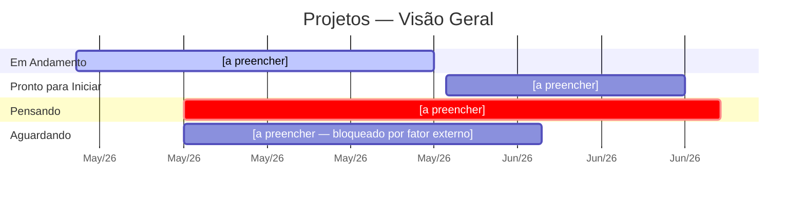
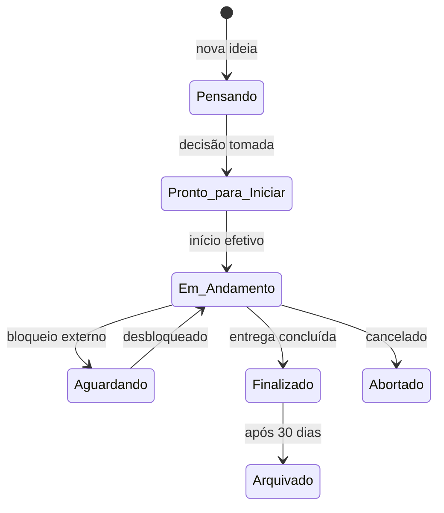

← [[Hub]]

# Timeline de Projetos

> Projetos organizados por status. Atualizar quando houver mudança de fase.



---

## Sistema de Status



---

## Projetos por Status

### Em Andamento

```dataview
LIST
FROM "[F1] 5-Frentes/Projetos/Em-Andamento"
SORT file.name ASC
```

### Pronto para Iniciar

```dataview
LIST
FROM "[F1] 5-Frentes/Projetos/Pronto-para-Iniciar"
SORT file.name ASC
```

### Aguardando

```dataview
LIST
FROM "[F1] 5-Frentes/Projetos/Aguardando"
SORT file.name ASC
```

### Pensando

```dataview
LIST
FROM "[F1] 5-Frentes/Projetos/Pensando"
SORT file.name ASC
```
