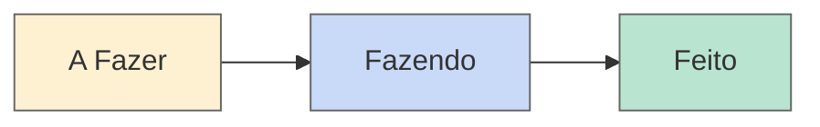

# 🎯 Próximas Etapas — Documentário O Fio da Memória

## 🟡 A FAZER (prioridade decrescente)
- [ ] Identificar 5–8 personagens potenciais (moradores antigos, famílias guardiãs de acervo)
- [ ] Levantar custo de produção mínimo (câmera, áudio, edição, trilha)
- [ ] Escolher duração e formato do documentário
- [ ] Conversar com 1–2 realizadores que já fizeram documentários locais
- [ ] Monitorar abertura de editais (Arranjos Regionais Audiovisual, PNAB Ciclo 3)

## 🔵 FAZENDO (máx 2 itens)
- [x] Mapear editais culturais abertos em 2026 ✅

## 🟢 FEITO (últimos 7 dias)
- [x] Pesquisa de editais concluída — ver [[2-pesquisas/_index.md]]
- [x] Identificado R$ 30M do Arranjo Regional Audiovisual para AL
- [x] Verificados 22 editais do PNAB Ciclo 2 (estadual) — encerrados

---

## ⚡ Próxima ação concreta
*Qual o menor passo que faz o projeto avançar HOJE?*

→ Marcar com Jadielson para revisar os resultados da pesquisa e definir próxima etapa (identificar personagens ou começar sinopse)

---
*Atualizado em 2026-06-19 — pesquisa de editais concluída.*